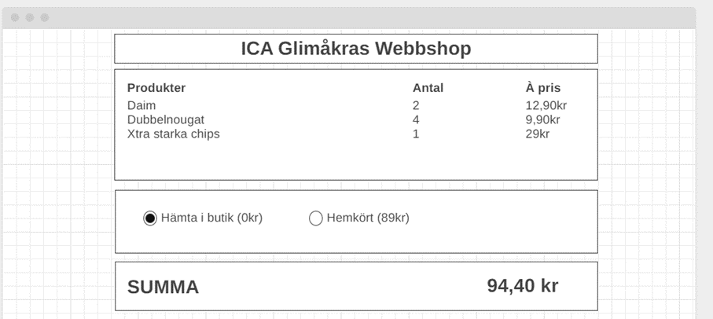

# Webbshops utcheckning - JS repetition 2

## Nivå 1 - basic  
* Skapa en sida likt den ovan  
* Gör ett javascript som räknar ut korrekt pris när sidan laddas  
* Räkna om priset om man byter mellan Hemkört/Hämta i butik  

## Nivå 2 - ändra produktantal
* Gör det möjligt att ändra antalet av respektive produkt  
* Kunna ta bort produkter helt från listan  
* Priset ska räknas om när ändringar sker  

## Nivå 3 - hantera hemkörning
* Lägg till en input för att fylla i postnummer för hemkörning  
* När man skriver i ett postnummer ska rätt ort skrivas ut och priset ändras för hemkörning  
* Söker man på ett postnummer som inte finns ska man få info om att hemkörning inte erbjuds hit  
* Många skriver postnummer med mellanslag i, se till så din funktion hanterar det automatiskt och kräv inte att användaren ändrar  
* Använd följande array med objekt för att söka upp postnummer i  
`let postnumbers = [
    {
        pn: 28272,
        city: "Sösdala",
        price: 109
    },
    {
        pn: 28946,
        city: "Glimåkra",
        price: 59
    },
    {
        pn: 28131,
        city: "Hässleholm",
        price: 99
    },
    {
        pn: 28341,
        city: "Osby",
        price: 79
    }
];`
